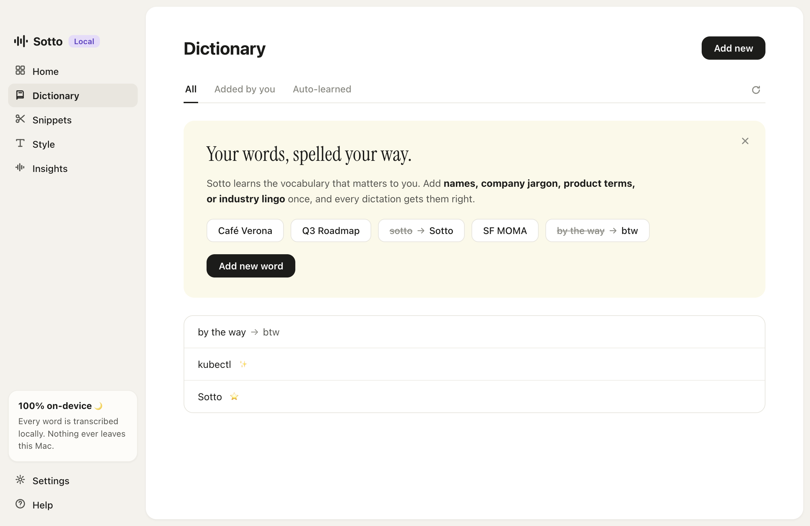

# Sotto

**Open-source voice dictation for macOS.** Hold a key, speak, release — clean,
formatted text appears at your cursor in any app. Modeled on the Wispr Flow
experience, rebuilt from scratch, and **100% local**: transcription runs
on-device with whisper.cpp. No account, no cloud, no telemetry.


## How it works

Hold **fn** (or a hotkey you pick), talk, and let go.

- Sotto records while you hold, then transcribes in one pass on-device
  (whisper.cpp with Metal, kept resident for sub-second turnaround).
- The transcript is cleaned deterministically: filler words stripped, spoken
  punctuation ("comma", "new line") applied, your dictionary and snippets
  applied — and self-corrections resolved by the **Backtrack engine**:
  - "meet at 5, no wait, 6" → *meet at 6* (slot swap: times, numbers, days,
    names)
  - "2pm today, make that 4pm tomorrow" → both slots corrected at once
  - "Send the report. Scratch that, send the deck." → only the deck survives
  - plain restatement works too ("as a gift… as a present"), and guard rails
    keep real sentences safe — "I actually enjoyed the movie" is never touched
  - stutters ("the the"), false starts, and comma-bound hedges vanish;
    "their going to" becomes "they're going to"
  - spoken emails ("jane dot smith at gmail dot com"), times ("5 PM" → 5pm),
    numbered lists ("first… second…"), and "thumbs up emoji" → 👍
  - four Auto Cleanup levels (None / Light / Medium / High) in Style, and
    every dictation keeps its raw transcript — one click reverts any AI edit
- The finished text is pasted at your cursor via a clipboard swap; your old
  clipboard is restored right after.

The **flow bar** — the little pill at the bottom of your screen — shows a live
waveform while you speak, shimmers while it thinks, and can be clicked for
hands-free mode (double-tapping the hotkey works too, Esc cancels). Drag it to
dock at the bottom, left, or right edge.

| | |
|---|---|
|  |  |

## AI Polish, Command Mode & context (all still on-device)

- **AI Polish (beta)** — Settings → System. A local LLM (Llama 3.2 3B via
  llama.cpp, ~2 GB one-time download) runs after the rule engine and catches
  the fuzzy corrections rules can't: "You know what, forget the pizza place.
  Book the sushi spot instead." → just the sushi part. Strict output
  validation means a bad LLM answer silently falls back to the deterministic
  text — it can never make things worse. Transcripts that contain
  instructions are typed as-is, never obeyed.
- **Command Mode** — select text anywhere, hold your talk key + **ctrl**
  (the pill turns purple), and say what to do: "make this more concise",
  "turn this into bullet points", "translate to Spanish".
- **Context awareness** — Sotto reads the text around your cursor through
  the Accessibility API (never password fields): dictating mid-sentence
  joins in lowercase with correct spacing, and the surrounding text is fed
  to AI Polish. All local, nothing uploaded.
- **Auto-learn dictionary** — hand-fix a word after dictating and Sotto
  notices, adding the corrected spelling to your dictionary (✨ entries).
- **Pro accuracy model** — whisper `large-v3-turbo` (quantized, ~574 MB)
  selectable in Settings → System for near-cloud accuracy, still local.

## Features

- **Push-to-talk & hands-free** dictation into any macOS app
- **Dictionary** — teach it names and jargon, plus "spoken → written" rules
  ("by the way" → "btw")
- **Snippets** — say "personal email", get your full address
- **Styles** — Formal / Casual / very casual casing and punctuation presets
- **"Press enter"** — end a dictation with it to send the message
- **History & insights** — searchable recent activity with audio playback,
  streaks, words dictated, average WPM
- **Guided onboarding** — permissions, mic check, hotkey choice, model download
- **100+ languages** via whisper's multilingual models, with auto-detect



## Install

Requirements: macOS 13+ on Apple Silicon, Xcode Command Line Tools
(`xcode-select --install`), Node 20+, and [Homebrew](https://brew.sh) with
whisper.cpp for building (`brew install whisper-cpp`).

```bash
git clone <this repo> sotto && cd sotto
npm install
npm run build:native   # builds keymon + bundles whisper.cpp into bin/
npm start
```

Onboarding walks you through microphone + Accessibility permissions and
downloads the speech model (~150 MB, one time). To build a standalone
`Sotto.app` (whisper.cpp bundled inside, Homebrew not needed afterwards):

```bash
npm run dist           # → dist/mac-arm64/Sotto.app
```

Tip: if the fn key opens the emoji picker or changes input sources on your
Mac, set *System Settings → Keyboard → "Press 🌐 key to" → Do Nothing*, or
pick a different hotkey in Settings → General.

## Testing

```bash
npm test               # unit suites: formatter, store, hotkey chords
npm run test:smoke     # + transcription E2E (synthesized speech → whisper),
                       #   app-launch autopilot (screenshots every screen),
                       #   full-pipeline dictation E2E (fake mic → pasteboard)
```

## Architecture

Electron with **zero runtime npm dependencies**. A small Swift helper
(`native/keymon.swift`) provides what Electron can't: global fn-key
detection via a CGEventTap, frontmost-app queries, and ⌘V injection. The
renderer records 16 kHz mono WAV through an AudioWorklet; the main process
runs `whisper-server` (resident model) with `whisper-cli` as fallback; a pure
formatter module applies every text rule (fully unit-tested). Data lives in
plain JSON under `~/Library/Application Support/Sotto/`.

See [docs/DESIGN.md](docs/DESIGN.md) for the full design document.

## Privacy

Everything — audio, transcripts, settings, stats — stays on your Mac.
Dictation audio is kept for 14 days (for playback in History), then pruned.
The only network request Sotto ever makes is downloading a whisper model.

## License

MIT. "Wispr Flow" is a trademark of its owner; Sotto is an independent
open-source project and is not affiliated with or endorsed by Wispr.
