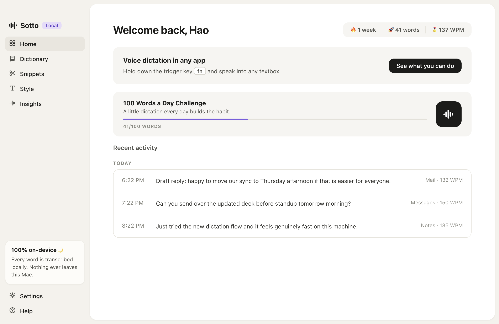
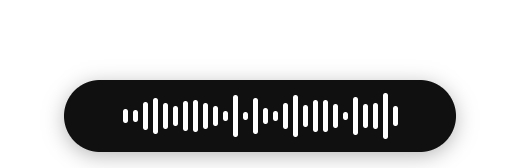

<div align="center">


**Open-source voice dictation for macOS. Hold a key, speak, release: polished text lands at your cursor in any app.**

[](LICENSE)
[](https://github.com/jappabl/sotto/releases/latest)
[-lightgrey.svg)](#requirements)
[](#testing)
[](#privacy)



</div>

Sotto is a from-scratch, fully local take on the modern AI dictation app. Hold **fn**, talk like a human (stumbles, "no wait", second thoughts and all), and let go. What gets typed is what you *meant*: fillers gone, self-corrections resolved, punctuation in place. Transcription runs on-device with whisper.cpp, cleanup runs on-device too, and nothing you say ever touches a server.

No account. No subscription. No cloud. The only network request Sotto ever makes is downloading a model.

| Idle | Recording |
|---|---|
|  |  |

## Install

**Option A: download the app.** Grab `Sotto-<version>-arm64.dmg` from the [latest release](https://github.com/jappabl/sotto/releases/latest), open it, drag Sotto into Applications. The app is not notarized (no Apple developer account), so the first launch needs a right-click on Sotto.app, then **Open**, then Open again.

**Option B: build from source.**

```bash
brew install whisper-cpp llama.cpp
git clone https://github.com/jappabl/sotto.git && cd sotto
npm install
npm run build:native
npm start
```

Either way, onboarding walks you through microphone + Accessibility permissions and downloads the speech model (~150 MB, one time). Then click into any textbox, hold **fn**, and say something.

### Or let your AI assistant install it

Paste this into Claude Code, Cursor, or any AI assistant that can run commands on your Mac:

```text
Set up Sotto, an open-source local voice dictation app for macOS, on this machine.

Repo: https://github.com/jappabl/sotto

1. Verify prerequisites: Apple Silicon Mac, Xcode Command Line Tools
   (xcode-select --install), Node 20+, and Homebrew. Install anything missing.
2. Run: brew install whisper-cpp llama.cpp
3. Run: git clone https://github.com/jappabl/sotto.git && cd sotto
4. Run: npm install && npm run build:native
5. Launch it with: npm start
6. Tell me what to click in onboarding: I need to grant Microphone and
   Accessibility permissions, pick a push-to-talk key, and let it download
   the speech model.
7. If my fn key opens the emoji picker, tell me to set System Settings >
   Keyboard > "Press globe key to" > Do Nothing, or pick another hotkey.
8. Afterwards, run npm test and node test/smoke/transcribe.test.js to
   confirm everything works, and summarize what I can do with the app.
```

## Meetings (new): a bot-free notetaker, fully local

Sotto also takes meeting notes the way Granola made people love, with no bot
joining your call and nothing leaving your Mac (macOS 14.4+):

- **Bot-free capture.** System audio (them) via a CoreAudio process tap +
  your mic (me), on Zoom, Meet, Teams, FaceTime, Slack, anything. Grant
  "System Audio Recording Only" once; no Screen Recording permission needed.
- **Your notes, completed.** Type half-thoughts during the call ("pricing
  pushback", "budget?"). When it ends, one click merges them with the
  transcript into finished notes. Your lines are the skeleton; the AI fills
  in what was actually said.
- **Trust built in.** Black text is what you wrote, gray is what Sotto heard;
  no line you wrote is ever dropped (guaranteed structurally, not by trusting
  the model); hover any gray line to see the transcript moment it came from.
- **The details.** Meeting detection ("Meeting detected in Zoom" - one click
  to start, never auto-records), live me/them transcript (hidden by default),
  templates (1:1, standup, sales, interview...), an accuracy re-pass with
  whisper large-turbo before enhancing, ask-anything chat with canned chips
  (List actions / TL;DR / Draft follow-up), echo suppression so laptop
  speakers don't duplicate lines, your dictionary steering whisper's
  spelling, and audio deleted after transcription.

A demo meeting is seeded on first run so you can try Enhance immediately.

## Ask: one place for everything you've said

Everything you dictate and every meeting you capture becomes searchable and
answerable from the **Ask** tab — a private second brain, all on-device:

- **Ask in plain language** — "what did we decide about pricing?", "list my
  open action items" — and get a direct answer built only from your own notes,
  with inline citations that deep-link to the exact meeting or dictation.
- **Hybrid retrieval** — BM25 keyword search fused with local embeddings
  (nomic-embed via llama.cpp) so paraphrases match, not just exact words
  ("how much to charge big companies" finds your enterprise-pricing note).
  Keyword-only works out of the box; semantic is a one-click 140 MB opt-in.
- **Grounded, not guessed** — a retrieval score floor and a fixed refusal keep
  the model from answering out of thin air, and every answer sentence is
  checked against the note it cites; anything unsupported gets underlined and
  flagged instead of silently trusted.
- **Nothing leaves the Mac** — retrieval, embeddings, and answers all run
  locally; no cloud, no account.

## What it does

- **Push-to-talk dictation** into any macOS app. Hold your key, speak, release. Double-tap for hands-free, Esc cancels, ping and pop sound cues.
- **Backtrack corrections.** "Meet at 5, no wait, 6" types *Meet at 6*. "Send it to John, I mean, Jane" swaps just the name. "2pm today, make that 4pm tomorrow" corrects both slots. Plain restatement works too, and guard rails keep real sentences safe: "I actually enjoyed the movie" is never touched.
- **Talk like a human.** Stutters ("the the"), false starts, filler words, and comma-bound hedges vanish. "their going to" becomes "they're going to".
- **AI Polish (beta).** An on-device LLM (Llama 3.2 3B via llama.cpp) catches the fuzzy cases rules cannot: "You know what, forget the pizza place. Book the sushi spot instead." comes out as just the sushi part. Strict output validation falls back to the deterministic text on anything suspicious, so polish can never make a dictation worse.
- **Command Mode.** Select text anywhere, hold your talk key + ctrl, and say what to do: "make this more concise", "translate to Spanish".
- **Context awareness.** Sotto reads the text around your cursor through the Accessibility API (never password fields). Dictating mid-sentence joins in lowercase with correct spacing.
- **Dictionary, snippets, styles.** Teach it names and jargon (plus spoken-to-written rules like "by the way" to "btw"), expand spoken triggers into boilerplate, and pick Formal / Casual / very casual output. Hand-fix a word after dictating and Sotto learns it automatically.
- **Spoken structure.** "comma", "new line", "bullet point", "first... second..." lists, "jane dot smith at gmail dot com", "thumbs up emoji", and "press enter" to send the message.
- **History and insights.** Recent activity with audio playback, streaks, words dictated, average WPM. Every dictation keeps its raw transcript; one click reverts any AI edit.
- **Never hears your music.** System output mutes during capture (restored the instant you release), and the mic picker refuses to auto-select loopback devices like BlackHole.

## Requirements

- Apple Silicon Mac, macOS 13 or newer
- For building from source: Node 20+, Xcode Command Line Tools, Homebrew with `whisper-cpp` (and `llama.cpp` for AI Polish)
- The packaged app from Releases bundles all binaries and needs no Homebrew

## Testing

```bash
npm test               # 91 unit tests: corrections, formatter, store, hotkeys
npm run test:smoke     # + synthesized-speech ASR tests, a screenshot autopilot
                       #   over every screen, a full fake-microphone dictation
                       #   E2E, and a live local-LLM polish test
```

## Architecture

Electron with zero runtime npm dependencies. A small Swift helper (`native/keymon.swift`) provides what Electron cannot: global fn-key detection via a CGEventTap, focused-field reading, and paste injection. Audio is captured at 16 kHz through an AudioWorklet, transcribed by a resident `whisper-server`, cleaned by a pure, fully unit-tested formatter pipeline, optionally polished by a resident `llama-server`, and pasted via a clipboard swap that restores your clipboard afterwards. Data lives in plain JSON under `~/Library/Application Support/Sotto/`.

See [docs/DESIGN.md](docs/DESIGN.md) for the full design document.

## Privacy

Everything (audio, transcripts, settings, stats) stays on your Mac. Dictation audio is kept 14 days for playback in History, then pruned. There is no telemetry, no account, and no server.

## Troubleshooting

- **fn opens the emoji picker:** System Settings > Keyboard > "Press globe key to" > Do Nothing, or pick a different hotkey in Settings > General.
- **Nothing types:** grant Accessibility in System Settings > Privacy & Security (Settings > System in Sotto shows live permission status).
- **Music keeps dictating itself:** that should be impossible now; check that "Mute system audio while dictating" is on in Settings > System, and that your Microphone setting is not a loopback device.

## Contributing

Issues and PRs welcome. `npm test` must pass; new formatter behavior needs a test. The correction engine lives in [electron/corrections.js](electron/corrections.js) and is the most fun file to extend.

## License

MIT. Built on [whisper.cpp](https://github.com/ggerganov/whisper.cpp) and [llama.cpp](https://github.com/ggerganov/llama.cpp). "Wispr Flow" is a trademark of its owner; Sotto is an independent project modeled on its interaction design and is not affiliated with or endorsed by Wispr.
